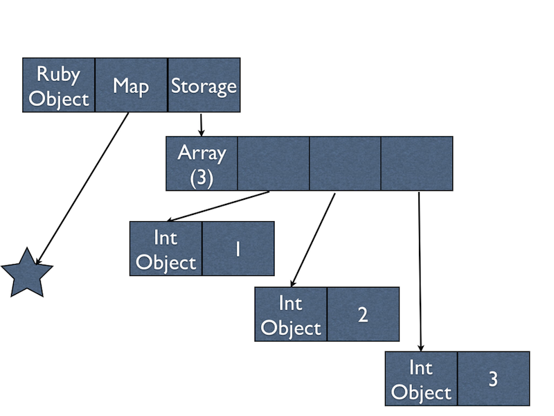
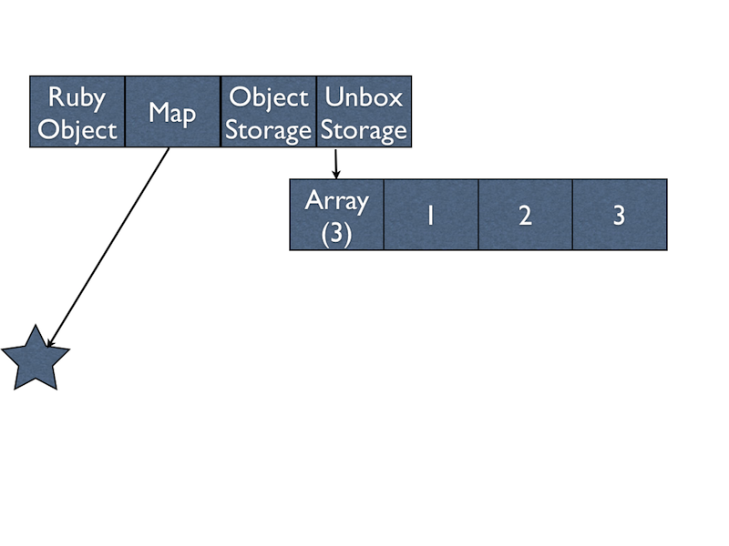

Type Specialized Instance Variables
===================================

**Posted: July 13, 2013**

In Topaz, like most other VMs, all objects are stored in what are called
"boxes". Essentially that means when you have something like ``x = 5``, ``x``
is really a pointer to an object which contains ``5``, not the value ``5``
itself. This is often a source of performance problems for VMs, this generates
more garbage for the GC to process and means that to access the value ``5``
more memory dereferences are needed. Topaz's just-in-time compiler (JIT) is
often able to remove these allocations and memory dereferences in individual
loops or functions, however it's not able to remove them in structures that
stick around in memory, like objects.

Therefore, over the past week I've been working on an optimization for Topaz
called "type specialized instance variables". Basically what that means is that
Topaz keeps track of what types instance variables in an object tend to have,
and then specializes the storage to remove the indirection for ``Fixnum`` and
``Float`` objects.

Let's look at an example:

.. sourcecode:: ruby

    class Point
      def initialize(x, y, z)
        @x = x
        @y = y
        @z = z
      end
    end

    p = Point.new(1, 2, 3)

Before this optimization, ``p`` looked like this in memory:

And after the optimization, it looks like this:

With this optimization landed, Topaz will use less memory and be faster for
programs that store ``Fixnum`` and ``Float`` objects in memory. If you're
interested in this type of optimization you can read about a similar one in
`PyPy for lists`_ that we're in the process of porting to Topaz.

We're looking forward to doing our first release soon, we hope you'll test
Topaz out, and give us feedback with the `nightly builds`_ until then

.. _`PyPy for lists`: http://morepypy.blogspot.com/2011/10/more-compact-lists-with-list-strategies.html
.. _`nightly builds`: http://topazruby.com/builds/
